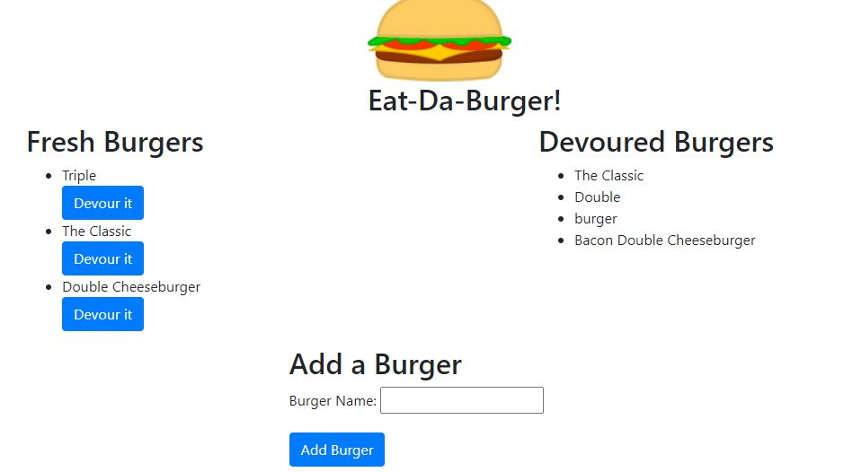

# Eat-Da-Burger!

## Deployed Heroku Link 
(https://thawing-bayou-87735.herokuapp.com/)

## Description:
    This app was created using MySQL, Node.js, Heroku, HTML, CSS, JavaScript, Express, and GitHub. The goal was to create an app that allowed a user to input different types of burgers then decide if they want to eat them/push over to the devoured section which also removed them from the created section. It utilizes the MVC approach, RESTFUL API, and CRUD methods.

## Table of Contents

- [Description](#description)
- [Installation](#installation)
- [Usage](#usage)
- [Contributing](#contributing)
- [Test](#test)
- [Credits](#credits)
- [License](#license)
- [Questions](#questions)

## Installation:
    npm i
 
## Test:
    npm test

## Usage:
    Please fork this repo if you are interested in updating or making changes. Please remember to pull before pushing. 

## Contributing:
    undefined

## License:
For more information about the MIT License, click on the link below.

- [License](https://opensource.org/licenses/MIT)

## Questions:
For additional information about the ReadMe Generator you can go to my GitHub page at the following link:

- [GitHub Profile](https://github.com/adgrossm)

For additional questions please email me at: adgrossm@gmail.com

 